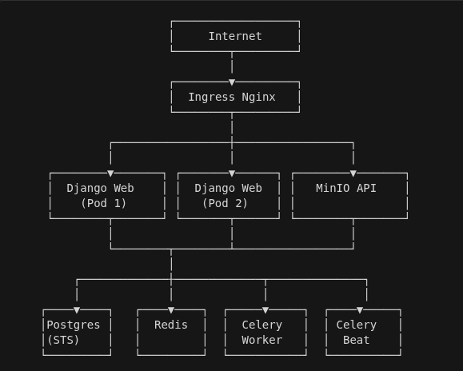
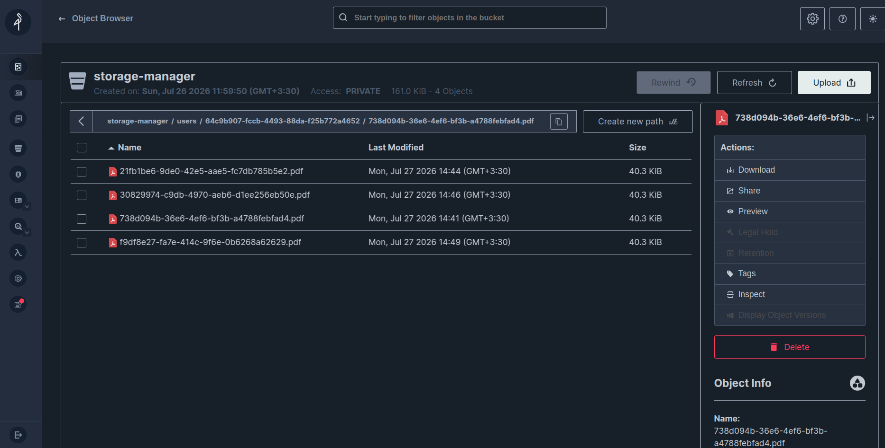

# راهنمای جامع پروژه Storage Manager
<div align="center">

# DevOps Section 👨‍💻

</div>
<div align="center">


</div>

---

## 📌 فهرست مطالب


- [معماری سیستم](#-معماری-سیستم)
- [ساختار پوشه‌ها](#-ساختار-پوشهها)
- [راه‌اندازی پروژه](#-راهاندازی-پروژه)
- [توضیح فایل‌های Kubernetes](#-توضیح-فایلهای-kubernetes)
- [مانیتورینگ](#-مانیتورینگ)
- [دستورات پرکاربرد](#-دستورات-پرکاربرد)


---

## 🎯 معرفی پروژه

پروژه مدیریت ذخیره سازی فایل که با جنگو و postgres و minio پیاده شده و توسعه داده شده  , برای devops از kubernetes استفاده شده و باقی موارد .....

### ویژگی‌های کلیدی


- ✅ مقیاس‌پذیری خودکار (HPA)
- ✅ ذخیره سازی با minIO 
- ✅ صف‌بندی وظایف با Celery + Redis
- ✅ دیتابیس PostgreSQL با StatefulSet
- ✅ خودکار سازی با CI با github action
- ✅ برای gitops از ArgoCD استفاده شده

---

## 🏗 معماری سیستم

<p align="center">
  
</p>


### کامپوننت‌های اصلی

| کامپوننت | نوع Resource | کاربرد |
|----------|--------------|--------|
| **Django Web** | Deployment + HPA | سرویس اصلی اپلیکیشن |
| **PostgreSQL** | StatefulSet | دیتابیس اصلی |
| **Redis** | Deployment | Broker و Cache |
| **MinIO** | Deployment | Object Storage |
| **Celery Worker** | Deployment | پردازش وظایف Async |
| **Celery Beat** | Deployment | زمان‌بندی وظایف |
| **Ingress Nginx** | Ingress | ورودی ترافیک |

---

## 📁 ساختار پوشه‌ها

```
storage-manager/
├── apps/                       # اپلیکیشن‌های Django
├── config/                     # تنظیمات اصلی پروژه (settings)
├── core/                       # ماژول‌های پایه و مشترک
├── docs/                       # مستندات پروژه
├── nginx/                      # کانفیگ Nginx
├── static/                     # فایل‌های استاتیک سورس
├── staticfiles/                # فایل‌های استاتیک جمع‌آوری شده
├── media/                      # فایل‌های آپلود شده
├── venv/                       # محیط مجازی پایتون
│
├── kubernetes/                 # 📦 K8S manifests
│   ├── namespace.yaml
│   ├── storage-manager-ingress.yaml
│   ├── celery-beat.yaml
│   │
│   ├── web/                    # Django Web
│   │   ├── configmap.yaml
│   │   ├── secret.yaml
│   │   ├── deployment.yaml
│   │   ├── service.yaml
│   │   └── hpa-django.yaml
│   │
│   ├── postgres/               # دیتابیس
│   │   ├── pvc.yaml
│   │   ├── secret.yaml
│   │   ├── service.yaml
│   │   └── statefulset.yaml
│   │
│   ├── redis/                  # Cache & Broker
│   │   ├── depolyment.yaml
│   │   └── service.yaml
│   │
│   ├── minio/                  # Object Storage
│   │   ├── deployment.yaml
│   │   ├── pvc.yaml
│   │   ├── secret.yaml
│   │   └── service.yaml
│   │
│   └── celery/                 # Celery Worker
│       └── deployment.yaml
│
├── .github/
│   └── workflows/              # 🔄 CI/CD Pipelines
│       └── ci.yaml
│
├── Dockerfile                  # Image اپلیکیشن
├── docker-compose.yaml         # برای اجرای لوکال
├── requirements.txt            # وابستگی‌های پایتون
├── prometheus.yml              # کانفیگ مانیتورینگ
├── manage.py
└── README.md
```

---

## ⚙️ پیش‌نیازها

قبل از شروع، مطمئن شوید ابزارهای زیر نصب هستند:

| ابزار | نسخه پیشنهادی | کاربرد |
|-------|----------------|--------|
| Docker | 24+ | Build ایمیج |
| kubectl | 1.28+ | تعامل با K8s |
| Kind | آخرین نسخه | کلاستر لوکال |
| Helm (اختیاری) | 3.x | مدیریت پکیج |
| ArgoCD CLI | آخرین نسخه | GitOps |
| Python | 3.11+ | اجرای لوکال |

---

## 🚀 راه‌اندازی پروژه

### 1️⃣ اجرای لوکال با Docker Compose

```bash
# کلون کردن پروژه
git clone https://github.com/amir-hash19/storage-manager.git
cd storage-manager

# ساخت فایل .env
cp .env.example .env

# اجرا
docker-compose up -d --build
```

### 2️⃣ راه‌اندازی روی Kubernetes

#### مرحله ۱: ساخت کلاستر

```bash
kind create cluster --config your-config.yaml
```

#### مرحله ۲: ساخت Image و Load در Minikube

```bash

# Build ایمیج
docker build -t storage-manager:latest .
```

#### مرحله ۳: ساخت Namespace

```bash
kubectl apply -f kubernetes/namespace.yaml
kubectl get ns
```

#### مرحله ۴: اعمال Secrets و ConfigMaps

```bash
# Secrets
kubectl apply -f kubernetes/postgres/secret.yaml
kubectl apply -f kubernetes/web/secret.yaml
kubectl apply -f kubernetes/minio/secret.yaml

# ConfigMaps
kubectl apply -f kubernetes/web/configmap.yaml
```

> ⚠️ **نکته امنیتی:** مقادیر Secrets را قبل از push در ریپو با `base64` مخفی کنید یا از Sealed Secrets استفاده کنید.

#### مرحله ۵: راه‌اندازی دیتابیس و Storage

```bash
# PostgreSQL
kubectl apply -f kubernetes/postgres/

# Redis
kubectl apply -f kubernetes/redis/

# MinIO
kubectl apply -f kubernetes/minio/
```

#### مرحله ۶: راه‌اندازی اپلیکیشن

```bash
# Django Web
kubectl apply -f kubernetes/web/

# Celery
kubectl apply -f kubernetes/celery/
kubectl apply -f kubernetes/celery-beat.yaml
```

#### مرحله ۷: Ingress

```bash
kubectl apply -f kubernetes/storage-manager-ingress.yaml
```

#### مرحله ۸: بررسی وضعیت

```bash
kubectl get pods -n storage-manager
kubectl get svc -n storage-manager
kubectl get ingress -n storage-manager
```

#### مرحله ۹: اجرای Migration و Collectstatic

```bash
POD=$(kubectl get pod -n storage-manager -l app=django-web -o jsonpath="{.items[0].metadata.name}")

kubectl exec -it $POD -n storage-manager -- python manage.py migrate
kubectl exec -it $POD -n storage-manager -- python manage.py collectstatic --noinput
kubectl exec -it $POD -n storage-manager -- python manage.py createsuperuser
```

#### مرحله ۱۰: دسترسی به اپلیکیشن

```bash
# اضافه کردن به /etc/hosts
echo "127.0.0.1 storage-manager.local" | sudo tee -a /etc/hosts

# باز کردن در مرورگر
# http://storage-manager.local
```

---

## 📦 توضیح فایل‌های Kubernetes

### `web/deployment.yaml`
بالا آوردنه 2 replica از اپلیکیشن Django با readiness و liveness probe.

### `web/hpa-django.yaml`
مقیاس خودکار بین 2 تا 5 پاد بر اساس مصرف CPU و Memory.

### `postgres/statefulset.yaml`
از StatefulSet استفاده شده چون Postgres به **stable network identity** و **Persistent Volume اختصاصی** نیاز دارد.


### `celery-beat.yaml`
زمان‌بندی تسک‌های دوره‌ای (مثلاً پاکسازی فایل‌های منقضی).

### `storage-manager-ingress.yaml`
مسیردهی به سرویس‌های داخل کلاستر با استفاده از Nginx Ingress.

---

## 🔄 CI/CD Pipeline

پروژه از **GitHub Actions** برای CI و **ArgoCD** برای CD استفاده می‌کند.

### Workflow کلی

```
┌──────────────┐    ┌──────────────┐    ┌──────────────┐    ┌──────────────┐
│  Push Code   │───▶│  Run Tests   │───▶│  Build Image │───▶│  Push to     │
│  to GitHub   │    │   & Lint     │    │   (Docker)   │    │   Registry   │
└──────────────┘    └──────────────┘    └──────────────┘    └──────┬───────┘
                                                                   │
                                                                   ▼
┌──────────────┐    ┌──────────────┐    ┌──────────────┐    ┌──────────────┐
│  App Live    │◀───│  ArgoCD Sync │◀───│  Update K8s  │◀───│  Detect New  │
│  on Cluster  │    │              │    │   Manifest   │    │    Image     │
└──────────────┘    └──────────────┘    └──────────────┘    └──────────────┘
```

### نمونه `.github/workflows/ci.yaml`

```yaml
name: CI

on:
  push:
    branches:
      - master

  pull_request:
    branches:
      - master

jobs:
  code-quality:
    name: Code Quality
    runs-on: ubuntu-latest

    steps:
      - name: Checkout repository
        uses: actions/checkout@v4

      - name: Set up Python
        uses: actions/setup-python@v5
        with:
          python-version: "3.12"
          cache: "pip"


      - name: Install dependencies
        run: |
          python -m pip install --upgrade pip
          pip install -r requirements.txt
          pip install black 


      - name: Check Black
        run: |
          black --check .

```


---


### نصب ArgoCD

```bash
kubectl create namespace argocd
kubectl apply -n argocd -f https://raw.githubusercontent.com/argoproj/argo-cd/stable/manifests/install.yaml
```

### دسترسی به UI

```bash
kubectl port-forward svc/argocd-server -n argocd 8080:443

# دریافت پسورد اولیه
kubectl -n argocd get secret argocd-initial-admin-secret -o jsonpath="{.data.password}" | base64 -d
```

### تعریف ابزار ArgoCD

```yaml
apiVersion: argoproj.io/v1alpha1
kind: Application
metadata:
  name: storage-manager
  namespace: argocd
spec:
  project: default
  source:
    repoURL: https://github.com/<your-username>/storage-manager.git
    targetRevision: main
    path: kubernetes
  destination:
    server: https://kubernetes.default.svc
    namespace: storage-manager
  syncPolicy:
    automated:
      prune: true
      selfHeal: true
    syncOptions:
      - CreateNamespace=true
```

### اضافه کردن ArgoCD

```bash
kubectl apply -f argocd-application.yaml
```

---

## 📊 مانیتورینگ

پروژه دارای `prometheus.yml` است. می‌توانید Prometheus و Grafana را با Helm نصب کنید:

```bash
helm repo add prometheus-community https://prometheus-community.github.io/helm-charts
helm install monitoring prometheus-community/kube-prometheus-stack -n monitoring --create-namespace
```

---

## 🛠 دستورات پرکاربرد

```bash
# مشاهده همه منابع در namespace
kubectl get all -n storage-manager

# لاگ‌های اپلیکیشن
kubectl logs -f -n storage-manager -l app=django-web

# ورود به پاد
kubectl exec -it <pod-name> -n storage-manager -- bash

# ری‌استارت Deployment
kubectl rollout restart deployment/django -n storage-manager

# مقیاس دادن دستی 
kubectl scale deployment django --replicas=3 -n storage-manager

# پاک کردن کل namespace
kubectl delete namespace storage-manager

# بررسی وضعیت HPA
kubectl get hpa -n storage-manager

# بررسی PVC‌ها
kubectl get pvc -n storage-manager
```

---
---
---
---
---


<div align="center">

# Backend Section 👨‍💻

</div>

## 🤝 مشارکت

1. Fork کنید
2. یک Branch جدید بسازید (`git checkout -b feature/amazing`)
3. Commit کنید (`git commit -m 'Add amazing feature'`)
4. Push کنید (`git push origin feature/amazing`)
5. Pull Request بزنید

---


# Storage Manager - کلون گوگل درایو

یک API بک‌اند مقیاس‌پذیر و قابل نگهداری که با **Django**، **Django REST Framework** و **احراز هویت JWT** ساخته شده و از **Clean Architecture**، **Service Layer**، **Repository Pattern** و **Event-Driven Architecture** پیروی می‌کند.

یکی از ماژول‌های اصلی این پروژه، یک **Storage Manager الهام‌گرفته از Google Drive** است که مدیریت پوشه‌های سلسله‌مراتبی، سازمان‌دهی فایل‌ها، آپلود، دانلود، جابه‌جایی، تغییر نام و حذف را از طریق یک API مبتنی بر REST فراهم می‌کند.

این پروژه به طور کامل با **Docker Compose** کانتینری شده و برای مقیاس‌پذیری، قابلیت نگهداری و جداسازی تمیز دغدغه‌ها طراحی شده است.

---

# ویژگی‌ها

- Clean Architecture
- Service Layer
- Repository Pattern
- Event-Driven Architecture
- احراز هویت JWT
- API مبتنی بر REST
- مدیریت پوشه و فایل (شبیه Google Drive)
- Docker و Docker Compose
- تسک‌های پس‌زمینه Celery
- Message Broker با Redis
- دیتابیس PostgreSQL
- Audit Logging
- صفحه‌بندی (Pagination)
- فیلترینگ و جستجو
- APIهای مبتنی بر مجوز (Permission-based)
- پردازش رویداد به‌صورت آسنکرون
- آماده برای مقیاس‌پذیری افقی

---

# تکنولوژی‌های استفاده‌شده

| تکنولوژی | هدف |
|------------|---------|
| Python | زبان برنامه‌نویسی |
| Django | فریم‌ورک وب |
| Django REST Framework | REST API |
| PostgreSQL | دیتابیس |
| Redis | Cache و Message Broker |
| Celery | تسک‌های پس‌زمینه |
| JWT | احراز هویت |
| Docker | کانتینری‌سازی |
| Docker Compose | توسعه لوکال |
| Clean Architecture | ساختار اپلیکیشن |
| Repository Pattern | لایه دسترسی به داده |
| Service Layer | منطق کسب‌وکار |
| Event Driven | کاهش وابستگی بین ماژول‌ها |

---
## داشبورد Object Storage

<p align="center">
  
</p>

# ساختار پروژه

```
project/
│
├── apps/
│   ├── useraccount/
│   ├── storage/
│   ├── dashboard/
│   └── auditlog/
│
├── config/
│
├── docker/
│
├── requirements/
│
├── docker-compose.yml
├── Dockerfile
└── manage.py
```

---

# ماژول‌های اپلیکیشن

## useraccount

مسئول موارد زیر است:

- ثبت‌نام کاربر
- ورود (Login)
- احراز هویت JWT
- مدیریت پروفایل
- مجوزها (Permissions)
- رویدادهای کاربر

---

## storage

مسئول موارد زیر است:

- مدیریت پوشه
- مدیریت فایل
- پوشه‌های تودرتو (Nested Directories)
- آپلود
- دانلود
- تغییر نام
- جابه‌جایی
- حذف
- رویدادهای Storage

سیستم Storage رفتاری مشابه **Google Drive** دارد و اجازه می‌دهد پوشه‌ها و فایل‌ها به‌صورت تودرتو و نامحدود ساخته شوند.

---

## dashboard

مسئول موارد زیر است:

- آمار داشبورد
- نمای کلی Storage
- متریک‌های کاربر
- خلاصه فعالیت‌ها

---

## auditlog

مسئول موارد زیر است:

- ثبت رویدادهای سیستم
- ردیابی فعالیت‌های کاربر
- لاگ عملیات فایل
- لاگ‌های احراز هویت
- تاریخچه رویدادها

---

# معماری (Architecture)

این پروژه از اصول **Clean Architecture** پیروی می‌کند.

```
                 HTTP Request
                       │
                       ▼
                DRF View / API
                       │
                       ▼
                 Service Layer
                       │
        ┌──────────────┴──────────────┐
        ▼                             ▼
 Repository Layer              Domain Events
        │                             │
        ▼                             ▼
   Django ORM                  Event Handlers
        │                             │
        └──────────────┬──────────────┘
                       ▼
                  PostgreSQL
```

هر لایه یک مسئولیت واحد دارد.

---

# لایه‌های Clean Architecture

## لایه Presentation (نمایش)

شامل:

- Views
- Serializers
- Permissions
- Authentication
- اعتبارسنجی API

مسئولیت‌ها:

- دریافت درخواست‌های HTTP
- اعتبارسنجی ورودی
- بازگرداندن پاسخ‌های HTTP

---

## لایه Service

شامل تمام منطق کسب‌وکار است.

مسئولیت‌ها:

- اجرای Use Caseها
- اعتبارسنجی قواعد کسب‌وکار
- هماهنگ‌سازی Repositoryها
- انتشار رویدادهای دامنه (Domain Events)

مثال:

```
Create Folder

Request
    ↓
Serializer
    ↓
FolderService.create_folder()
    ↓
FolderRepository.create()
    ↓
FolderCreatedEvent
```

---

## لایه Repository

مسئول ارتباط با دیتابیس است.

مسئولیت‌ها:

- کوئری زدن به دیتابیس
- ساخت رکورد
- به‌روزرسانی رکورد
- حذف رکورد

سرویس‌ها هرگز به‌صورت مستقیم با Django ORM ارتباط برقرار نمی‌کنند.

به‌جای آن:

```
Service
    ↓
Repository
    ↓
ORM
```

---

## رویدادهای دامنه (Domain Events)

اپلیکیشن با استفاده از رویدادها به‌صورت loosely coupled نگه‌داری می‌شود.

نمونه رویدادها:

```
UserRegisteredEvent

UserLoggedInEvent

FolderCreatedEvent

FolderDeletedEvent

FolderRenamedEvent

FileUploadedEvent

FileDeletedEvent

FileMovedEvent

PasswordChangedEvent
```

هر رویداد می‌تواند چندین Listener داشته باشد.

مثال:

```
FolderCreatedEvent

        │
        ├────────► Audit Logger
        │
        ├────────► Dashboard Update
        │
        └────────► Notification
```

هیچ ماژولی به‌طور مستقیم به ماژول دیگر وابسته نیست.

---

# ساختار پوشه (مثال)

```
storage/

├── api/
│   ├── serializers.py
│   ├── views.py
│   └── urls.py
│
├── services/
│   ├── folder_service.py
│   └── file_service.py
│
├── repositories/
│   ├── folder_repository.py
│   └── file_repository.py
│
├── events/
│   ├── publishers.py
│   ├── handlers.py
│   └── events.py
│
├── models.py
├── permissions.py
└── signals.py
```

هر اپلیکیشن از همین معماری پیروی می‌کند.

---

# جریان درخواست (Request Flow)

```
Client
   │
   ▼
APIView
   │
   ▼
Serializer Validation
   │
   ▼
Service Layer
   │
   ▼
Repository Layer
   │
   ▼
Database
   │
   ▼
Publish Event
   │
   ▼
Event Handlers
   │
   ▼
Response
```

---

# جریان رویداد (Event Flow)

```
Business Action
       │
       ▼
Publish Event
       │
       ▼
Event Dispatcher
       │
 ┌─────┼───────────┐
 ▼     ▼           ▼

Audit  Dashboard  Notifications
```

---

# احراز هویت

احراز هویت با استفاده از **JWT** پیاده‌سازی شده است.

جریان معمول:

```
Register

↓

Login

↓

Access Token

↓

Refresh Token

↓

Authenticated APIs
```

---

# Endpointهای API

## احراز هویت

| متد | Endpoint | توضیح |
|---------|----------|-------------|
| POST | `/api/auth/register/` | ثبت‌نام کاربر جدید |
| POST | `/api/auth/login/` | ورود |
| POST | `/api/auth/refresh/` | تازه‌سازی JWT Token |
| POST | `/api/auth/logout/` | خروج |
| GET | `/api/auth/profile/` | کاربر فعلی |
| PATCH | `/api/auth/profile/` | به‌روزرسانی پروفایل |
| POST | `/api/auth/change-password/` | تغییر رمز عبور |

---

## Storage

### APIهای پوشه

| متد | Endpoint | توضیح |
|---------|----------|-------------|
| GET | `/api/storage/folders/` | لیست پوشه‌ها |
| POST | `/api/storage/folders/` | ساخت پوشه |
| GET | `/api/storage/folders/{id}/` | جزئیات پوشه |
| PATCH | `/api/storage/folders/{id}/` | تغییر نام پوشه |
| DELETE | `/api/storage/folders/{id}/` | حذف پوشه |
| POST | `/api/storage/folders/{id}/move/` | جابه‌جایی پوشه |

---

### APIهای فایل

| متد | Endpoint | توضیح |
|---------|----------|-------------|
| GET | `/api/storage/files/` | لیست فایل‌ها |
| POST | `/api/storage/files/upload/` | آپلود فایل |
| GET | `/api/storage/files/{id}/` | جزئیات فایل |
| GET | `/api/storage/files/{id}/download/` | دانلود فایل |
| PATCH | `/api/storage/files/{id}/` | تغییر نام فایل |
| DELETE | `/api/storage/files/{id}/` | حذف فایل |
| POST | `/api/storage/files/{id}/move/` | جابه‌جایی فایل |

---

## داشبورد

| متد | Endpoint | توضیح |
|---------|----------|-------------|
| GET | `/api/dashboard/overview/` | نمای کلی داشبورد |
| GET | `/api/dashboard/storage/` | آمار Storage |
| GET | `/api/dashboard/activity/` | فعالیت‌های اخیر |

---

## Audit Logs

| متد | Endpoint | توضیح |
|---------|----------|-------------|
| GET | `/api/audit/logs/` | لیست Audit Logها |
| GET | `/api/audit/logs/{id}/` | جزئیات Audit Log |

---

# اجرا با Docker

این پروژه به‌طور کامل کانتینری شده است.

## شروع

```bash
docker compose up --build
```

---

## توقف

```bash
docker compose down
```

---

## اجرای Migrationها

```bash
docker compose exec web python manage.py migrate
```

---

## ساخت Superuser

```bash
docker compose exec web python manage.py createsuperuser
```

---

## اجرای تست‌ها

```bash
docker compose exec web pytest
```

---

# سرویس‌ها

Docker Compose سرویس‌های زیر را راه‌اندازی می‌کند:

- Django API
- PostgreSQL
- Redis
- Celery Worker
- Celery Beat (اختیاری)

---

# چرا این معماری؟

این معماری فراهم می‌کند:

- جداسازی تمیز دغدغه‌ها
- منطق کسب‌وکار قابل تست
- ماژول‌های loosely coupled
- مقیاس‌پذیری آسان
- قابلیت نگهداری بالا
- افزودن آسان ویژگی‌های جدید
- کامپوننت‌های دامنه مستقل
- حداقل وابستگی به ORM در منطق کسب‌وکار

---

# بهبودهای آینده

- API Versioning
- مستندات OpenAPI / Swagger
- اعلان‌های WebSocket
- اشتراک‌گذاری فایل
- کنترل دسترسی مبتنی بر نقش (RBAC)
- مجوزهای سطح Object
- Soft Delete
- پشتیبانی Multi-Tenant
- Event Bus توزیع‌شده (Kafka/RabbitMQ)
- ذخیره‌سازی S3 / MinIO
- مانیتورینگ با Prometheus و Grafana

---

# لایسنس

این پروژه به‌عنوان یک قالب بک‌اند آماده تولید (production-ready) طراحی شده که Clean Architecture، Service Layer، Repository Pattern و طراحی Event-Driven را با استفاده از Django و Django REST Framework به نمایش می‌گذارد.


<div align="center">

**   ساخته شده با ❤️ Amir-hash19  **

</div>